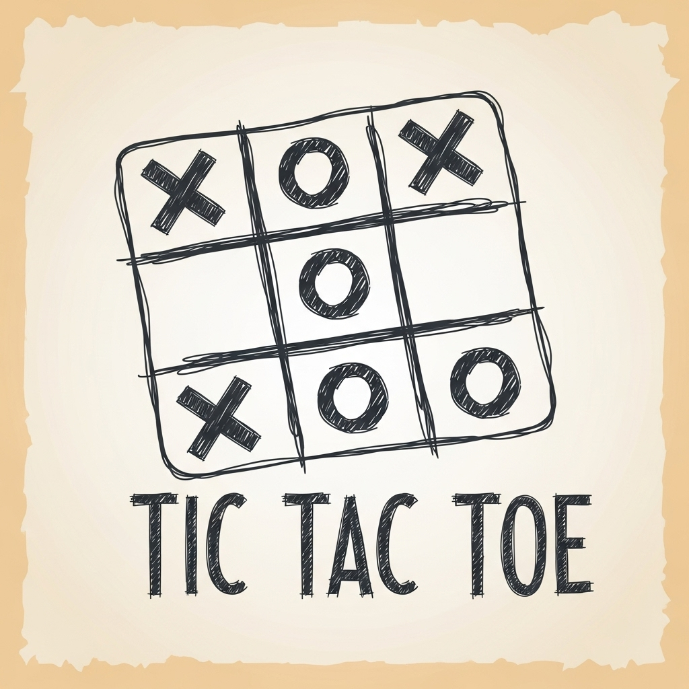

# React Tic-Tac-Toe Game

<p align="center">
  
</p>

[](https://reactjs.org/)
[](https://vitejs.dev/)
[](https://developer.mozilla.org/en-US/docs/Web/JavaScript)
[](https://opensource.org/licenses/MIT)

A modern implementation of the classic Tic-Tac-Toe game built with React and Vite. This project demonstrates React fundamentals including state management, components, and game logic.

## Features

- Interactive game board
- Player name customization
- Game move history/log
- Win detection
- Game over state
- Responsive design with custom styling

## Technologies Used

- React
- Vite
- JavaScript (JSX)
- CSS

## Getting Started

### Prerequisites

- Node.js (version 12 or higher)
- npm or yarn

### Installation

1. Clone the repository
```bash
git clone [https://github.com/sulimansharadqa/Tic-Tac-Toe]
```

2. Navigate to the project directory
```bash
cd Tic-Tac-Toe
```

3. Install dependencies
```bash
npm install
```

### Running the Application

To start the development server:
```bash
npm run dev
```

The application will be available at `http://localhost:5173` by default.

## Project Structure

```
src/
  ├── components/      # React components
  │   ├── GameBoard.jsx
  │   ├── GameOver.jsx
  │   ├── Log.jsx
  │   └── Player.jsx
  ├── App.jsx         # Main application component
  ├── index.jsx       # Application entry point
  └── index.css       # Global styles
```

## How to Play

1. Enter player names (optional)
2. Players take turns clicking on the game board to place their symbol (X or O)
3. The game will automatically detect when a player wins or when there's a draw
4. Click "Rematch!" to start a new game

## License

This project is licensed under the MIT License.